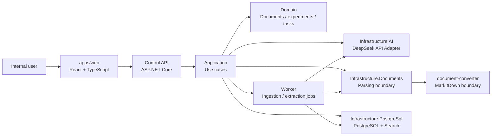

<h1 align="center">SyLabAI</h1>

<p align="center">A public portfolio demo for a lab AI assistant, focused on experiment document search, structured experiment records, path suggestions, and lab task handoff.</p>

<p align="center">
  <a href="./README.md">简体中文</a> | <a href="./README.en.md">English</a>
</p>

<p align="center">
  
  
  
  
  <a href="./LICENSE"></a>
</p>

SyLabAI is a public portfolio demo for an internal lab AI assistant concept. It is designed to demonstrate an engineering approach for `AI + experiment documents + knowledge retrieval + experiment path assistance + human review`.

The repository currently contains the project skeleton, architecture notes, engineering constraints, privacy boundaries, reference-project notes, and an initial runnable scaffold: a React workspace UI, ASP.NET Core Control API, layered Application/Domain/Infrastructure projects, synthetic knowledge retrieval, experiment extraction, path suggestion drafts, and lab task cards.

> This public repository does not contain real company documents, experiment data, supplier material, API keys, business screenshots, or internal workflows. Any future demo data should be synthetic, public, or redacted. A real company deployment should be built separately in a private internal repository with its own security and deployment design.

## Planned Features

- Document ingestion for SOPs, experiment reports, historical records, product data, public papers, and patent references.
- Document parsing and chunking with source metadata.
- Source-grounded Q&A with citations.
- Structured experiment record extraction.
- Draft experiment path suggestions with assumptions, evidence, risks, and human review status.
- Lab task cards or SOP drafts for manual execution.
- Result feedback for future iterations.

## Planned Stack

| Area | Direction |
| --- | --- |
| Frontend | React, TypeScript, Vite |
| Backend | ASP.NET Core Web API |
| Application layer | C# application services, DTOs, use-case boundaries |
| Storage | PostgreSQL as the only project database |
| Retrieval | PostgreSQL full-text / keyword retrieval first; vector retrieval remains optional |
| AI Provider | DeepSeek API through an OpenAI-compatible adapter |
| Documents | MarkItDown behind a document conversion boundary |
| Deployment | Windows Server / intranet, IIS or Kestrel |

## Architecture



## Repository Layout

```text
SyLabAI/
├── apps/web
├── backend/dotnet/control-plane
├── backend/services/document-converter
├── docs
├── scripts/windows
├── data
├── uploads
├── outputs
├── .tools
├── .cache
├── .config
└── .tmp
```

## Privacy Boundary

This repository is public and should never include:

- real lab records, internal SOPs, supplier data, customer data, or company screenshots;
- DeepSeek API keys or other provider secrets;
- PostgreSQL dumps, logs, uploaded files, generated reports, or raw provider payloads;
- local absolute paths, raw prompts, or unredacted operational evidence.

See [Operations And Evidence Boundary](./docs/operations-and-evidence.md) and [Engineering Constraints](./docs/engineering-constraints.md) for details.

## Documentation

- [Engineering Constraints](./docs/engineering-constraints.md)
- [Architecture](./docs/architecture.md)
- [Development](./docs/development.md)
- [Operations And Evidence Boundary](./docs/operations-and-evidence.md)
- [Reference Projects](./docs/reference-projects.md)
- [Product Plan](./docs/product-plan.md)
- [Codex / developer entrypoint](./AGENTS.md)

## Local Development

The current backend uses PostgreSQL persistence for knowledge and task data. Provider model listing and connectivity tests are explicit settings actions; generation calls remain disabled unless provider settings explicitly enable guarded live calls, and the public demo should not process real uploads or generate private reports.

Backend:

```powershell
cd <repo-root>
dotnet restore .\backend\dotnet\control-plane\SyLabAI.ControlPlane.sln
dotnet build .\backend\dotnet\control-plane\SyLabAI.ControlPlane.sln
dotnet run --project .\backend\dotnet\control-plane\src\SyLabAI.ControlApi\SyLabAI.ControlApi.csproj
```

Frontend:

```powershell
cd <repo-root>\apps\web
npm install
npm run dev
```

The web app calls `http://127.0.0.1:5200` by default. Set `VITE_SYLABAI_API_BASE_URL` to override it.

## Roadmap

- Harden PostgreSQL persistence, indexing, backup, and retrieval workflows for larger datasets.
- Extend the dry-run provider boundary into a guarded DeepSeek/OpenAI-compatible provider adapter.
- Add synthetic public demo documents.
- Replace simple chunking with a controlled MarkItDown document parsing boundary.
- Expand experiment record extraction and path suggestion drafts.
- Add basic GitHub Actions checks.
