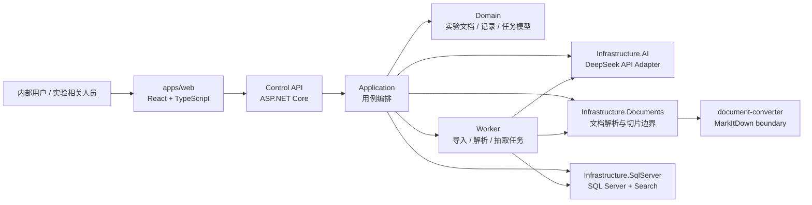
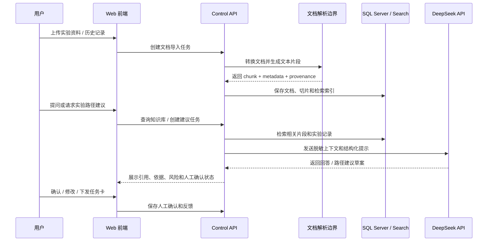

<h1 align="center">SyLabAI</h1>

<p align="center">韶远实验 AI 助手 Demo，面向实验资料检索、历史实验记录结构化、路径建议和实验室任务下发的 Windows 内网 AI 应用方案。</p>

<p align="center">
  <a href="./README.md">简体中文</a> | <a href="./README.en.md">English</a>
</p>

<p align="center">
  
  
  
  
  <a href="./LICENSE"></a>
</p>

SyLabAI 是一个面向实验室知识工作的公开 Demo 项目，定位为“韶远实验 AI 助手”的技术敲门砖。项目目标不是复刻真实企业内部系统，而是用一套可公开展示的工程骨架，表达我对 `AI + 实验资料 + 文档检索 + 实验路径辅助 + 人工确认闭环` 的理解。

当前仓库处于初始工程化阶段，已经整理出目录结构、架构约束、产品计划、数据隐私边界和参考项目说明，并补充了第一版可运行骨架：React 前端工作台、ASP.NET Core Control API、分层 Application/Domain/Infrastructure 项目、合成资料检索、实验记录抽取、路径建议草案和任务卡 Demo。

> 说明：本仓库不包含任何真实企业内部资料、实验数据、供应商资料、API Key、业务截图或内部流程文件。所有后续演示数据都应使用脱敏样例或虚拟数据。真实业务系统如果落地，应在单位内部另起私有项目并重新做权限、数据、安全和部署设计。

## 界面预览

> 以下为本地运行截图（演示模式，无真实业务数据）。

| 工作台总览 | 运行边界（Provider 配置） |
| --- | --- |
|  |  |

## 项目功能规划

- 实验文档导入：上传 SOP、实验报告、历史记录、产品资料、公开文献或专利资料。
- 文档解析与切片：通过文档解析边界转换为可检索文本，并保留来源、页码、章节等追溯信息。
- 知识库问答：基于来源片段回答问题，返回引用和证据，避免只给无来源的 AI 结论。
- 实验记录结构化：抽取实验条件、参数、结果指标、失败原因和备注。
- 路径建议辅助：根据资料和历史记录生成候选实验路径、依据、假设、风险点和待确认事项。
- 实验室任务下发：生成任务卡或 SOP 草案，供实验人员人工确认和执行。
- 结果反馈闭环：记录人工执行后的结果，为下一轮检索和路径建议提供依据。

## 技术栈规划

| 模块 | 技术方向 |
| --- | --- |
| 前端 | React、TypeScript、Vite |
| 后端控制面 | ASP.NET Core Web API |
| 应用层 | C# Application Services、DTO、Use Case 边界 |
| 数据存储 | SQL Server 作为唯一项目数据库 |
| 检索 | SQL Server 关键词检索优先，全文检索保留为可选增强，向量检索保留为可选扩展 |
| AI Provider | DeepSeek API，通过 OpenAI-compatible adapter 接入 |
| 文档解析 | MarkItDown 作为候选解析器，放在独立文档转换边界 |
| 部署目标 | Windows Server / 内网部署，IIS 或 Kestrel |
| 约束 | API-only、无 Docker 依赖、无 Linux 前提、无本地模型强依赖 |

## 系统架构



SyLabAI 的第一版不会把 Docker、Linux、本地大模型或云端 SaaS 作为生产前提。前端只通过 Control API 访问后端能力；AI Provider、文档解析、文件系统、数据库和检索能力都放在明确边界内，避免 Demo 一开始就堆成难维护的脚本集合。

## 目录结构

```text
SyLabAI/
├── apps/
│   └── web/                              # React + TypeScript 前端
├── backend/
│   ├── dotnet/control-plane/             # ASP.NET Core Control API 与后端分层
│   │   ├── src/SyLabAI.ControlApi
│   │   ├── src/SyLabAI.Application
│   │   ├── src/SyLabAI.Domain
│   │   ├── src/SyLabAI.Infrastructure.AI
│   │   ├── src/SyLabAI.Infrastructure.Documents
│   │   ├── src/SyLabAI.Infrastructure.SqlServer
│   │   ├── src/SyLabAI.Worker
│   │   └── tests/SyLabAI.ControlApi.Tests
│   └── services/document-converter/      # 文档解析 sidecar / adapter 边界
├── docs/                                 # 架构、开发、约束、运维和参考项目说明
├── scripts/windows/                      # Windows 本地开发、验证和部署脚本
├── data/                                 # runtime 数据占位，不提交真实数据
├── uploads/                              # 上传文件目录，占位不提交真实文件
├── outputs/                              # 生成报告 / 任务卡，占位不提交真实输出
├── .tools/ .cache/ .config/ .tmp/         # 项目本地工具、缓存、配置和临时目录
├── AGENTS.md
├── README.md
└── LICENSE
```

## 核心业务链路



## 数据与隐私说明

本项目是公开作品集 Demo，因此默认不公开任何真实业务材料：

- 不提交真实实验记录、内部 SOP、供应商资料、客户资料或企业内部截图。
- 不提交 DeepSeek API Key、Provider Secret、数据库文件、日志、上传文件或生成报告。
- 不在 public DTO、日志、截图或文档中暴露本地绝对路径、原始 Provider Payload 或未脱敏 Prompt。
- 后续如需演示，会使用虚拟实验数据、公开资料或人工构造的合成样例。

更多边界见 [运维与证据边界](./docs/operations-and-evidence.md) 和 [工程约束](./docs/engineering-constraints.md)。

## 本地开发

当前仓库已经具备第一版前后端 scaffold。后端使用 SQL Server 作为唯一项目数据库保存资料和任务数据；Provider 模型列表与联通测试只通过设置页显式触发，生成调用仍默认关闭，不会处理真实上传文件或生成私有报告。

### 1. 后端

```powershell
cd <repo-root>
dotnet restore .\backend\dotnet\control-plane\SyLabAI.ControlPlane.sln
dotnet build .\backend\dotnet\control-plane\SyLabAI.ControlPlane.sln
dotnet run --project .\backend\dotnet\control-plane\src\SyLabAI.ControlApi\SyLabAI.ControlApi.csproj
```

### 2. 前端

```powershell
cd <repo-root>\apps\web
npm install
npm run dev
```

### 3. 文档解析边界

```powershell
cd <repo-root>\backend\services\document-converter
python -m venv .venv
.\.venv\Scripts\python -m pip install -r requirements.txt
```

前端默认调用 `http://127.0.0.1:5200`。如需调整，设置 `VITE_SYLABAI_API_BASE_URL`。

## 项目亮点

- 选题贴近真实产业场景：不是普通聊天机器人，而是围绕实验资料、历史结果、路径建议和人工确认闭环设计。
- Windows Server / 内网优先：适合企业内部工具形态，不强行依赖 Docker 或 Linux 运维。
- API-only：模型能力通过远程 API 接入，避免本地部署大模型带来的硬件和运维负担。
- 来源可追溯：知识问答和路径建议都强调 citations / provenance，而不是只输出无依据结论。
- 工程边界先行：在写业务代码前先定义 Control API、Application、Domain、Infrastructure 和 Document Converter 边界。
- 公开 Demo 与真实业务隔离：仓库只展示工程思路，不放真实企业数据。

## 文档导航

- [工程约束](./docs/engineering-constraints.md)
- [总体架构](./docs/architecture.md)
- [开发说明](./docs/development.md)
- [运维与证据边界](./docs/operations-and-evidence.md)
- [参考项目说明](./docs/reference-projects.md)
- [产品计划](./docs/product-plan.md)
- [Codex/开发入口约束](./AGENTS.md)

## 后续可改进方向

- 将 demo 进程内资料存储替换为 SQL Server 持久化、索引和检索。
- 将当前 dry-run Provider 状态扩展为受保护的 DeepSeek OpenAI-compatible Provider Adapter。
- 构造公开、脱敏、可演示的实验资料样例。
- 将简单文档切片替换为受控 MarkItDown 文档解析边界。
- 扩展实验记录结构化抽取与路径建议草案。
- 补充 GitHub Actions 的基础构建和 Markdown 检查。
