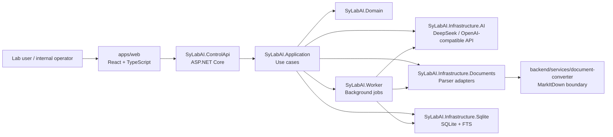
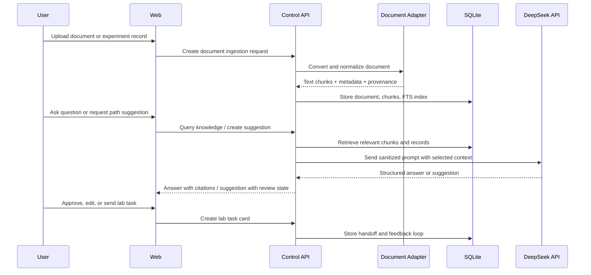

# Architecture

SyLabAI is a Windows Server / intranet-first lab AI assistant. The system is organized as a small monorepo with one web app, one .NET control plane, optional background workers, and a narrow document-conversion boundary.

## System Shape



## Components

| Component | Path | Responsibility |
| --- | --- | --- |
| Web app | `apps/web` | Internal UI for documents, search, experiment records, suggestions, lab tasks, and settings. |
| Control API | `backend/dotnet/control-plane/src/SyLabAI.ControlApi` | HTTP API, endpoint modules, request validation, auth/rate gates, and response shaping. |
| Application | `backend/dotnet/control-plane/src/SyLabAI.Application` | Business use cases and orchestration. |
| Domain | `backend/dotnet/control-plane/src/SyLabAI.Domain` | Domain entities, value objects, and provider-independent contracts. |
| AI infrastructure | `backend/dotnet/control-plane/src/SyLabAI.Infrastructure.AI` | Remote model providers, DeepSeek/OpenAI-compatible adapter, retry, redaction, and structured provider errors. |
| Document infrastructure | `backend/dotnet/control-plane/src/SyLabAI.Infrastructure.Documents` | Document conversion interfaces, chunking, metadata normalization, and parser safety checks. |
| SQLite infrastructure | `backend/dotnet/control-plane/src/SyLabAI.Infrastructure.Sqlite` | SQLite persistence, migrations, repositories, FTS search, and optional future vector store. |
| Worker | `backend/dotnet/control-plane/src/SyLabAI.Worker` | Durable background work such as ingestion, extraction, and batch suggestion jobs. |
| Document converter | `backend/services/document-converter` | Optional Python boundary for MarkItDown or other document parsers. |
| Windows scripts | `scripts/windows` | Local setup, run, verification, and future Windows service helpers. |

## Backend API Modules

Recommended Control API module layout:

```text
SyLabAI.ControlApi/Modules/
├── Health
├── Documents
├── Knowledge
├── Experiments
├── Suggestions
├── LabTasks
└── Settings
```

Module responsibilities:

- `Health`: liveness, readiness, version, and local dependency checks.
- `Documents`: upload, ingest, parse status, document metadata, source preview.
- `Knowledge`: search, source-grounded Q&A, citation retrieval.
- `Experiments`: historical experiment records, structured extraction, result feedback.
- `Suggestions`: experiment path suggestions, assumptions, risks, evidence, and human review state.
- `LabTasks`: task cards, SOP drafts, handoff status, result return.
- `Settings`: provider settings, model selection, parsing options, local app preferences.

## Frontend Product Areas

Recommended web feature layout:

```text
apps/web/src/features/
├── dashboard
├── document-library
├── knowledge-chat
├── experiment-records
├── path-suggestions
├── lab-tasks
└── settings
```

Feature responsibilities:

- `dashboard`: current project overview, recent documents, pending jobs, and lab task status.
- `document-library`: document upload, parsing progress, metadata, and source browsing.
- `knowledge-chat`: source-grounded Q&A and citation inspection.
- `experiment-records`: structured experiment conditions, result fields, failures, and feedback.
- `path-suggestions`: AI-generated candidate paths with evidence, risks, and review.
- `lab-tasks`: task cards, SOP drafts, manual execution handoff, and result return.
- `settings`: provider/API settings, parsing options, and local runtime checks.

## MVP Flow



## Data Strategy

MVP persistence should use SQLite because it is simple, Windows-friendly, and enough for a single internal tool or early prototype.

Initial retrieval should use:

- normalized document chunks,
- SQLite FTS for keyword retrieval,
- optional LLM reranking through DeepSeek,
- citations tied to document/chunk metadata.

Vector search should stay optional until an approved embedding API exists. If embeddings are introduced later, the vector store should be a replaceable infrastructure detail.

## Deployment Direction

First deployment target:

- Windows Server,
- internal network,
- ASP.NET Core via Kestrel or IIS reverse proxy,
- static web build served by the same host or IIS,
- no Docker or Linux dependency,
- project-local runtime data paths.

## Safety Boundary

SyLabAI assists with knowledge retrieval and experiment planning. It should present suggestions as drafts with evidence, assumptions, and risks. Final experiment decisions, safety checks, and lab execution remain human responsibilities.
